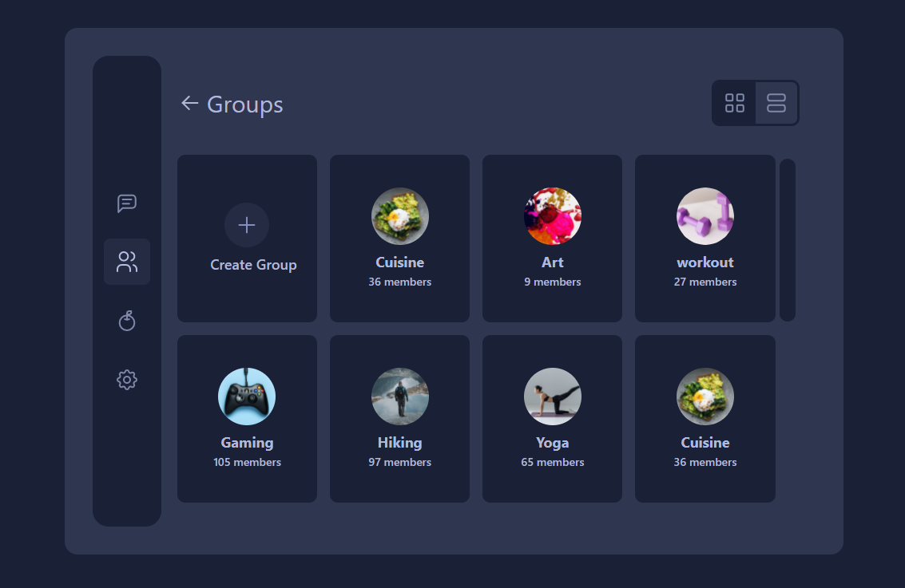

# Chat-React-Tailwind

## Table of contents

- [Overview](#overview)
  - [The challenge](#the-challenge)
  - [Screenshot](#screenshot)
  - [Links](#links)
- [My process](#my-process)
  - [Built with](#built-with)
  - [What I learned](#what-i-learned)
  - [Useful resources](#useful-resources)
- [Author](#author)

## Overview

### The challenge

Users should be able to:

- Navigate between Routes
- Switch between grid layout and list layout in some pages (by the buttons)
- See Chat, Group, Save, Setting pages and it's content
- View the optimal layout for the site depending on their device's screen size
- See hover states for all interactive elements on the page

### Screenshot



### Links

- Live Site URL: [Live](https://chat-react-tialwind.vercel.app/)
- Solution URL: [solution](https://github.com/MiladRostami01/Chat-react-tialwind)

## My process

### Built with

- [React](https://reactjs.org/)
- JSX
- Context Api
- Custom Hooks
- [React-router](https://reactrouter.com/)
- [Tailwind](https://tailwindcss.com/) - css framework
- Flexbox
- CSS Grid
- Desktop-first workflow

### What I learned

- How to navigate between pages and using [React-router](https://reactrouter.com/)
- How to create toggle button in [React](https://reactjs.org/)
- Using Context Api to prevent Props-drilling
- How to Create and use Custom Hooks

```jsx
function Groups() {
  const layoutMode = useLayoutMode()

  const layoutStyle = layoutMode === "grid" ? "md:grid-cols-4 " : "md:grid-cols-2"

  return (
    <div
      className={`w-full grid gap-4 row-auto md:overflow-y-auto md:h-[436px] h-auto ${layoutStyle}`}
    >
      <Card>
        <div className="h-[56px] w-[56px] flex justify-center items-center cursor-pointer bg-veryDark rounded-full">
          <svg
            width="32"
            height="32"
            viewBox="0 0 32 32"
            fill="none"
            xmlns="http://www.w3.org/2000/svg"
          >
            <path
              d="M16 6.66666V25.3333"
              stroke="#808FBE"
              stroke-width="2"
              stroke-linecap="round"
              stroke-linejoin="round"
            />
            <path
              d="M6.66666 16H25.3333"
              stroke="#808FBE"
              stroke-width="2"
              stroke-linecap="round"
              stroke-linejoin="round"
            />
          </svg>
        </div>
        <div className="text-textColor text-[18px] mt-2 font-medium ml-4">
          Create Group
        </div>
      </Card>
      {GroupsData.map(group => {
        return (
          <Card key={group.id}>
            <div>
              
            </div>
            <div className={`text-center ${layoutMode === "list" ? "ml-5" : ""}`}>
              <div className="text-textColor text-[18px] mt-2 font-bold">
                {group.title}
              </div>
              <div className="text-textColor text-[14px] font-medium">
                {group.members} members
              </div>
            </div>
          </Card>
        )
      })}
    </div>
  )
}

export default Groups
```

### Useful resources

- [How-to-create-Toggle-button](https://www.youtube.com/watch?v=bztDMD4HSL0) 
- [React-Sideba-Navigation-Menu-Tutorial](https://www.youtube.com/watch?v=CXa0f4-dWi4) 

## Author

- Website - [miladrostami.ir](https://miladrostami01.ir/)
- Instagram - [milad_rostami_01](https://www.instagram.com/milad_rostami_01/)
- Linkedin - [miladrostami01](https://www.linkedin.com/in/miladrostami01/)


## Getting Started with Create React App

This project was bootstrapped with [Create React App](https://github.com/facebook/create-react-app).

### Available Scripts

In the project directory, you can run:

#### `npm start`

Runs the app in the development mode.\
Open [http://localhost:3000](http://localhost:3000) to view it in your browser.

The page will reload when you make changes.\
You may also see any lint errors in the console.

#### `npm test`

Launches the test runner in the interactive watch mode.\
See the section about [running tests](https://facebook.github.io/create-react-app/docs/running-tests) for more information.

#### `npm run build`

Builds the app for production to the `build` folder.\
It correctly bundles React in production mode and optimizes the build for the best performance.

The build is minified and the filenames include the hashes.\
Your app is ready to be deployed!

See the section about [deployment](https://facebook.github.io/create-react-app/docs/deployment) for more information.

#### `npm run eject`

**Note: this is a one-way operation. Once you `eject`, you can't go back!**

If you aren't satisfied with the build tool and configuration choices, you can `eject` at any time. This command will remove the single build dependency from your project.

Instead, it will copy all the configuration files and the transitive dependencies (webpack, Babel, ESLint, etc) right into your project so you have full control over them. All of the commands except `eject` will still work, but they will point to the copied scripts so you can tweak them. At this point you're on your own.

You don't have to ever use `eject`. The curated feature set is suitable for small and middle deployments, and you shouldn't feel obligated to use this feature. However we understand that this tool wouldn't be useful if you couldn't customize it when you are ready for it.

### Learn More

You can learn more in the [Create React App documentation](https://facebook.github.io/create-react-app/docs/getting-started).

To learn React, check out the [React documentation](https://reactjs.org/).

#### Code Splitting

This section has moved here: [https://facebook.github.io/create-react-app/docs/code-splitting](https://facebook.github.io/create-react-app/docs/code-splitting)

#### Analyzing the Bundle Size

This section has moved here: [https://facebook.github.io/create-react-app/docs/analyzing-the-bundle-size](https://facebook.github.io/create-react-app/docs/analyzing-the-bundle-size)

#### Making a Progressive Web App

This section has moved here: [https://facebook.github.io/create-react-app/docs/making-a-progressive-web-app](https://facebook.github.io/create-react-app/docs/making-a-progressive-web-app)

#### Advanced Configuration

This section has moved here: [https://facebook.github.io/create-react-app/docs/advanced-configuration](https://facebook.github.io/create-react-app/docs/advanced-configuration)

#### Deployment

This section has moved here: [https://facebook.github.io/create-react-app/docs/deployment](https://facebook.github.io/create-react-app/docs/deployment)

#### `npm run build` fails to minify

This section has moved here: [https://facebook.github.io/create-react-app/docs/troubleshooting#npm-run-build-fails-to-minify](https://facebook.github.io/create-react-app/docs/troubleshooting#npm-run-build-fails-to-minify)
